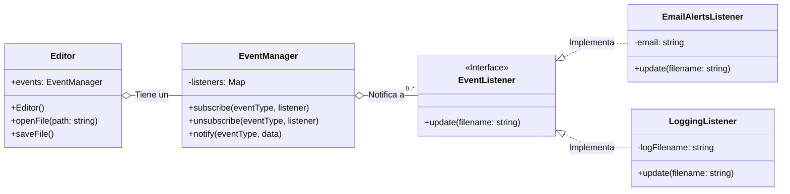

```mermaid
classDiagram
    direction LR
    %% La dirección LR organiza el flujo de izquierda a derecha (Editor -> Manager -> Listeners)

    %% --- 1. EL SUJETO (De editor.ts) ---
    class Editor {
        +events: EventManager
        +Editor()
        +openFile(path: string)
        +saveFile()
    }

    %% --- 2. EL GESTOR (De event-manager.ts) ---
    class EventManager {
        -listeners: Map
        +subscribe(eventType, listener)
        +unsubscribe(eventType, listener)
        +notify(eventType, data)
    }

    %% --- 3. LA INTERFAZ (De event-listener.interface.ts) ---
    class EventListener {
        <<Interface>>
        +update(filename: string)
    }

    %% --- 4. LOS SUSCRIPTORES (De listeners.ts) ---
    class EmailAlertsListener {
        -email: string
        +update(filename: string)
    }

    class LoggingListener {
        -logFilename: string
        +update(filename: string)
    }

    %% --- RELACIONES ---
    %% Basado en cómo se conectan tus archivos:

    %% 1. El Editor tiene UN gestor (Propiedad 'public events' en editor.ts)
    Editor o-- EventManager : Tiene un

    %% 2. El Manager tiene MUCHOS listeners (El Map guarda arrays 'EventListener[]' en event-manager.ts)
    %% Aquí usamos "0..*" como en tu ejemplo de stichi stichi
    EventManager o-- "0..*" EventListener : Notifica a

    %% 3. Las clases concretas implementan la interfaz (keyword 'implements' en listeners.ts)
    EventListener <|.. EmailAlertsListener : Implementa
    EventListener <|.. LoggingListener : Implementa
```
